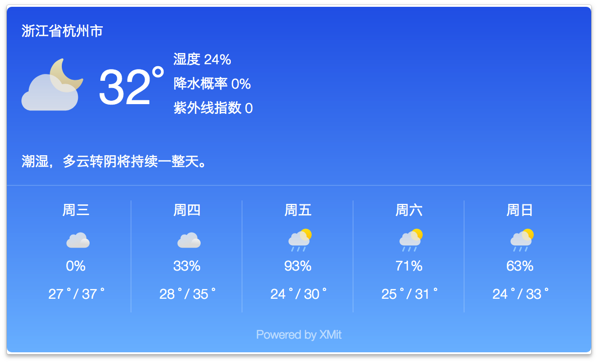

# chrome-extension-weather

基于 Vue 的天气预报扩展

### 安装扩展

[点这里安装扩展](https://chrome.google.com/webstore/detail/%E7%A4%BE%E4%BC%9A%E5%A4%A9%E6%B0%94/ngjmfihbidfhambfmjhanenemhnnfehg/related?hl=zh-CN)

### 目录结构

`/dist` — 存放扩展的主要文件夹（本地加载扩展只需要加载这个文件夹)

### 项目截图



### 构建应用

``` bash
# install dependencies
npm install

# serve with hot reload at localhost:8080
npm run dev

# build for production with minification
npm run build

# build for production and view the bundle analyzer report
npm run build --report
```

For a detailed explanation on how things work, check out the [guide](http://vuejs-templates.github.io/webpack/) and [docs for vue-loader](http://vuejs.github.io/vue-loader).
